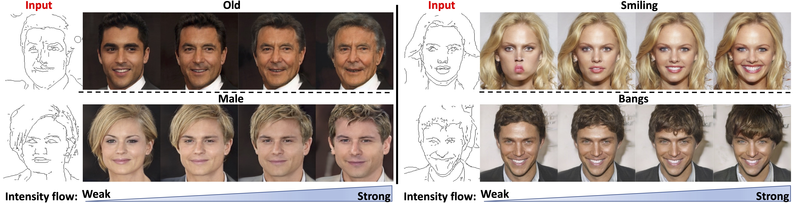

# S2FGAN-pytorch Implementation


## Dependency
* python 3.7.4
* numpy 1.18.1
* Pillow 7.0.0
* opencv-python 4.2.0.32
* torch 1.5.1  
* torchvision 0.5.0
* albumentations 0.4.6
* cudnn 7.6.5
* CUDA 10.1

At least a single GPU is needed. Please install the library with CUDA and C++ in Linux system.

## Dataset
* Obtain [CeleAMask-HQ dataset](https://github.com/switchablenorms/CelebAMask-HQ).
* Download pertained HED model from https://github.com/s9xie/hed.
* Extract sketch (Hed Edge) using the scripts in https://www.pyimagesearch.com/2019/03/04/holistically-nested-edge-detection-with-opencv-and-deep-learning/. 
* Post-process the sketch by using the method indicated by Isola. Note: Matlab Required. Use `PostprocessHED.m` from their github. Paper Name: Image-to-Image Translation with Conditional Adversarial Networks. Github link:https://github.com/phillipi/pix2pix/tree/master/scripts/edges
* Zip the post-processed sketch.

## Notice
* Currently, the S2FGAN only tested in 256x256 resolution.
* For training the model on the CelebAMask-HQ dataset, 16GB RAM is required.

## Train S2FGAN

* The validation images will be saved in `sample` folder, the model checkpoints will be saved in `checkpoint`, the training log will be written in  `log.txt`.

* For training, please run `train.py`, while set the parameters properly.

```bash
python train.py --help

--iter                                 #total training iterations
--batch                                #batch size
--r1                                   #weight of the r1 regularization
--d_reg_every                          #interval of the applying r1 regularization to discriminator 
--lr                                   #learning rate
--augment                              #apply discriminator augmentation
--augment_p                            #probability of applying discriminator augmentation. 0 = use adaptive augmentation
--ada_target                           #target augmentation probability for adaptive augmentation
--ada_length                           #target duraing to reach augmentation probability for adaptive augmentation
--ada_every                            #probability update interval of the adaptive augmentation
--img_height                           #image height
--img_width                            #image width
--NumberOfImage                        #The number of images in the zip.
--imageZip                             #input image zip
--hedEdgeZip                           #hed sketch zip
--hedEdgePath                          #hed_edge_256
--imagePath                            #path of images in the zip
--TORCH_HOME                           #The director store pertained pytorch model, "None" will load the pertained model from default director.
--label_path                           #attributes annotation text file of CelebAMask-HQ
--selected_attrs                       #selected attributes for the CelebAMask-HQ dataset
--ATMDTT                               #Attributes to manipulate during testing time   
--model_type                           #0- S2F-DIS, 1- S2F-DEC
``` 

* Train on S2F-DIS

```bash
python3 train.py --model_type 0 #Please set data path properly. 
```

* Train on S2F-DEC

```bash
python3 train.py --model_type 1 #Please set data path properly. 
```

## Train AttGAN
The AttGAN implementation is from https://github.com/elvisyjlin/AttGAN-PyTorch.

## Train STGAN
The STGAN implementation is from https://github.com/bluestyle97/STGAN-pytorch.

## Calculate FID Score
The FID score can be calculated from https://github.com/mseitzer/pytorch-fid.

## Calculate IS Score
The IS score can be calculated from https://github.com/sbarratt/inception-score-pytorch.

## Evaluation Classifier
The evaluation classier can be obtained from https://github.com/csmliu/STGAN.

## License
The Equalized layer, Modulated layer, PixelNorm and CUDA kernels are from offical styleGAN. For more details, please refer to repostiories: https://github.com/NVlabs/stylegan2

Thanks for Rosinality's StyleGAN pytorch implementation. The S2FGAN builds based on this template: https://github.com/rosinality/stylegan2-pytorch.

The dataloader is based on eriklindernoren's repostiories: https://github.com/eriklindernoren/PyTorch-GAN

The AttGAN can be find in https://github.com/elvisyjlin/AttGAN-PyTorch

Data prefetcher is based on the implementation from NVIDIA Apex: https://github.com/NVIDIA/apex/blob/master/examples/imagenet/main_amp.py#L256

The HED detector loading and Crop layer implementation is from Rosebrock: https://www.pyimagesearch.com/2019/03/04/holistically-nested-edge-detection-with-opencv-and-deep-learning/


