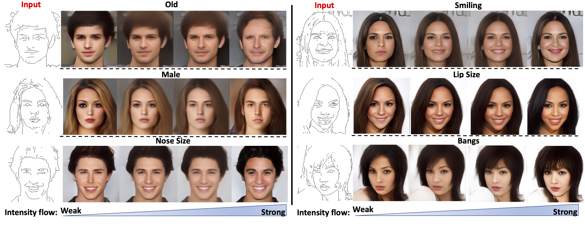

# S2FGAN-pytorch Implementation


## Dependency
* [NVIDIA APEX](link:https://github.com/NVIDIA/apex)     
* python 3.7.4
* numpy 1.18.1
* Pillow 7.0.0
* opencv-python 4.2.0.32
* torch 1.5.1  
* torchvision 0.5.0
* albumentations 0.4.6
* cudnn 7.6.5
* CUDA 10.1

At least a single GPU is needed. Because of the full functionality requirement for APEX library, please install the library with CUDA and C++ in Linux system.

## Dataset
* Obtain [CeleAMask-HQ dataset](https://github.com/switchablenorms/CelebAMask-HQ).
* Download pertained HED model from https://github.com/s9xie/hed.
* Extract sketch and masks by using the scripts in `data_process` folder.

```bash
cd data_process
python Generate_mask.py --help

--size                         #The size of images to save
--img_num                      #Number of images in total
--inputZip                     #The input zip
--imagePath                    #path of image for input zip
--maskPath                     #path of mask for input zip     
--edge_detector                #Path of pretrained HED edge detector
```
* Post-process the sketch by using the method indicated by Isola. Note: Matlab Required. Use `PostprocessHED.m` from their github. Paper Name: Image-to-Image Translation with Conditional Adversarial Networks. Github link:https://github.com/phillipi/pix2pix/tree/master/scripts/edges
* Zip the post-processed sketch.

## Notice
* Currently, the S2FGAN only supports 128x128,256x256 and 512x512 resolution.
* For training the model on the CelebAMask-HQ dataset, 16GB RAM is required.

## Train S2FGAN

* The S2FGAN can be trained by using `train.py`. The validation images will be saved in `images` folder, the model checkpoints will be saved in `saved_models`, the training log will be written in  `images`.

* Resume from check points can be controlled by `epoch` paramters, when it not equals 0. It will load the specified checkpoints.

* The sample images will be saved in `images` folder, the checkpoints will be saved in `saved_models` folder. The training logs are rendered in `log.txt`.

* For training, please run `train.py`, while set the parameters properly.

```bash
python train.py --help

--epoch                                #epoch to start training from
--n_epochs                             #number of epochs of training
--batch_size                           #batch size
--lr                                   #learning rate
--b1                                   #decay of first order momentum of gradient
--b2                                   #decay of first order momentum of gradient
--img_height                           #image height
--img_width                            #image width
--lambda_vgg                           #The weight of vgg perceptual loss
--lambda_reconst                       #The weight of image reconstruction loss
--lambda_ratio                         #The weight of attribute reconstruction loss 
--channels                             #number of image channels, sketch:1, mask:18
--sample_interval                      #how regular to generate demonstration (steps)
--checkpoint_interval                  #how regular to save models (epoch)
--TORCH_HOME                           #The director store pertained pytorch model, "None" will load the pertained model from default director.
--NumberOfImage                        #The number of images in the zip.
--imageZip                             #input image zip
--imagePath                            #path of images in the zip
--hedEdgeZip                           #hed sketch zip
--hedEdgePath                          #hed_edge_256
--maskZip                              #mask zip
--label_path                           #attributes annotation text file of CelebAMask-HQ
--task_type                            #0- edge to image, 1-mask to image, 2- super resolution
--selected_attrs                       #selected attributes for the CelebAMask-HQ dataset
--ATMDTT                               #Attributes to manipulate during testing time   
``` 

* Train on sketch to image translation

```bash
python3 train.py --task_type 0 --channels 1 #Please set data path properly. 
```

* Train on  mask to image translation

```bash
python3 train.py --task_type 1 --channels 18 #Please set data path properly. 
```

## Train AttGAN
The AttGAN implementation is from https://github.com/elvisyjlin/AttGAN-PyTorch.

## Train STGAN
The STGAN implementation is from https://github.com/bluestyle97/STGAN-pytorch.

## Calculate FID Score
The FID score can be calculated from https://github.com/mseitzer/pytorch-fid.

## Evaluation Classifier
The evaluation classier can be obtained from https://github.com/csmliu/STGAN.
## License
The Equalized layer, Modulated layer, PixelNorm and CUDA kernels are from offical styleGAN. For more details, please refer to repostiories: https://github.com/NVlabs/stylegan2

Thanks for Rosinality's StyleGAN pytorch implementation. The S2FGAN is based on: https://github.com/rosinality/stylegan2-pytorch.

The template of code are based on eriklindernoren's repostiories: https://github.com/eriklindernoren/PyTorch-GAN

The AttGAN can be find in https://github.com/elvisyjlin/AttGAN-PyTorch

Data prefetcher is based on the implementation from NVIDIA Apex: https://github.com/NVIDIA/apex/blob/master/examples/imagenet/main_amp.py#L256

The HED detector loading and Crop layer implementation is from Rosebrock: https://www.pyimagesearch.com/2019/03/04/holistically-nested-edge-detection-with-opencv-and-deep-learning/

Loading mask from CeleAMask-HQ dataset is based on https://github.com/switchablenorms/CelebAMask-HQ/tree/master/face_parsing/Data_preprocessing


